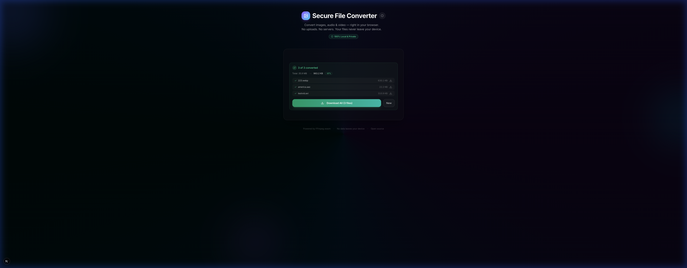

# ConvertLocal

> **Convert images, audio, and video — 100% in your browser.**
> No uploads. No servers. Your files never leave your device.

[](LICENSE)

---

## 📸 Screenshots

| Initial Load | Files Queued | Conversion Results |
|:---:|:---:|:---:|
|  |  |  |

---

## ✨ Features

- 🖼️ **Image conversion** — PNG, JPG, WebP, BMP, TIFF, ICO, TGA, HEIC (input)
- 🎵 **Audio conversion** — MP3, WAV, OGG, AAC, FLAC, M4A
- 🎬 **Video conversion** — MP4, WebM, MOV, AVI, MKV, GIF
- 📁 **Batch conversion** — up to 10 files at once, each with its own output format
- 🔒 **100% local** — all processing via FFmpeg.wasm in the browser
- 📂 **Drag-and-drop** or click-to-browse file upload
- 📊 **Real-time progress** bar (per-file and overall)
- 📦 **Size comparison** with compression percentage
- 📥 **Download All** — zip multiple converted files via JSZip
- ℹ️ **Info modal** — explains how the app protects your privacy
- 🌙 **Premium dark UI** with glassmorphism and animations
- ♿ **Accessible** — keyboard navigable, proper ARIA roles
- ✅ **114 automated tests** via Vitest

## 📋 Supported Formats

### 🖼️ Image

| Input | Available Outputs |
|-------|-------------------|
| PNG | JPG, WebP, BMP, TIFF, ICO, TGA |
| JPEG | PNG, WebP, BMP, TIFF, ICO, TGA |
| WebP | PNG, JPG, BMP, TIFF, TGA |
| BMP | PNG, JPG, WebP, TIFF, TGA |
| TIFF | PNG, JPG, WebP, BMP, TGA |
| TGA | PNG, JPG, WebP, BMP, TIFF |
| ICO | PNG, JPG, WebP, BMP, TIFF, TGA |
| HEIC | PNG, JPG, WebP, BMP, TIFF, TGA |

### 🎵 Audio

| Input | Available Outputs |
|-------|-------------------|
| MP3 | WAV, OGG, AAC, FLAC, M4A |
| WAV | MP3, OGG, AAC, FLAC, M4A |
| OGG | MP3, WAV, AAC, FLAC, M4A |
| AAC | MP3, WAV, OGG, FLAC, M4A |
| FLAC | MP3, WAV, OGG, AAC, M4A |
| M4A | MP3, WAV, OGG, AAC, FLAC |

### 🎬 Video

| Input | Available Outputs |
|-------|-------------------|
| MP4 | WebM, MOV, AVI, MKV, GIF |
| WebM | MP4, MOV, AVI, MKV, GIF |
| MOV | MP4, WebM, AVI, MKV, GIF |
| AVI | MP4, WebM, MOV, MKV, GIF |
| MKV | MP4, WebM, MOV, AVI, GIF |
| GIF | MP4, WebM, MOV, AVI, MKV |

> **Note:** GIF is treated as a video format (animated) and can be converted to/from standard video formats.

## 🛡️ Security

| Guarantee | How |
|-----------|-----|
| No network requests | FFmpeg runs in WebAssembly — verify in DevTools |
| Cross-Origin Isolation | COOP + COEP headers enable `SharedArrayBuffer` |
| Content Security Policy | Strict CSP; `ws:` only in dev; `blob:` for WASM workers |
| File size limit | 50 MB max per file to keep browser memory safe |
| No production logging | All `console.*` calls gated behind `NODE_ENV` |

## 🚀 Getting Started

```bash
# Clone the repo
git clone https://github.com/gammahazard/secure-file-converter.git
cd secure-file-converter

# Install dependencies (also fetches FFmpeg WASM core files)
npm install

# Start the dev server
npm run dev
```

Open [http://localhost:3000](http://localhost:3000) in Chrome, Edge, or Firefox.

> **Note:** The `postinstall` script automatically copies `ffmpeg-core.js` and `ffmpeg-core.wasm` from `@ffmpeg/core` into `public/ffmpeg/`. These files are not committed to git.

## 🏗️ Architecture

```
src/
├── app/
│   ├── layout.tsx              # Root layout (dark mode, Inter font, SEO meta)
│   ├── globals.css             # Theme, gradients, glassmorphism, animations
│   └── page.tsx                # Slim orchestrator — queue state + composition
├── components/
│   ├── icons.tsx               # App-specific inline SVG icons
│   ├── drop-zone.tsx           # Multi-file drag-and-drop (up to 10 files)
│   ├── file-queue.tsx          # Grouped file list with per-file format selectors
│   ├── file-info.tsx           # Single file thumbnail + metadata
│   ├── format-selector.tsx     # Output format picker (standalone)
│   ├── convert-button.tsx      # Gradient CTA with loading/converting states
│   ├── progress-bar.tsx        # Overall conversion progress
│   ├── result-card.tsx         # Single-file result (preview + download)
│   ├── batch-result-card.tsx   # Multi-file results (individual + zip download)
│   ├── info-modal.tsx          # Privacy & supported formats modal
│   ├── roadmap-modal.tsx       # Upcoming features modal
│   └── ui/                     # Shadcn UI primitives (button, card, dialog, etc.)
├── converters/
│   ├── types.ts                # Shared types (FormatInfo, InputFormat, QueueItem)
│   ├── registry.ts             # Format registry + constants (MAX_FILE_SIZE, MAX_FILES)
│   ├── image.ts                # Image formats (self-registering)
│   ├── audio.ts                # Audio formats (self-registering)
│   ├── video.ts                # Video formats (self-registering)
│   └── index.ts                # Barrel — triggers registration, re-exports
├── hooks/
│   └── useFFmpeg.ts            # FFmpeg.wasm hook (singleton, convertFile, convertBatch)
└── lib/
    └── utils.ts                # cn(), formatBytes()
```

### Adding a new format

1. Open the relevant category file in `src/converters/`
2. Add a `FormatInfo` preset and call `registerFormat()`
3. Done — the UI and conversion hook pick it up automatically

### Adding a new feature / editor

The app is designed for extensibility. Each component is focused and
self-contained. To add a feature like image editing before conversion:

1. Create a new component in `src/components/` (e.g. `image-editor.tsx`)
2. Add any new hooks in `src/hooks/`
3. Wire it into `page.tsx`'s state machine between the "ready" and "converting" states

See [CONTRIBUTING.md](CONTRIBUTING.md) for detailed instructions.

## 📜 Scripts

| Command | Description |
|---------|-------------|
| `npm run dev` | Start dev server (Turbopack) |
| `npm run build` | Production build |
| `npm run lint` | Run ESLint |
| `npm run test` | Run Vitest test suite (114 tests) |
| `npm run postinstall` | Fetch FFmpeg WASM files (runs automatically) |

## 🛠️ Tech Stack

- **Framework:** Next.js 16 (App Router, Turbopack)
- **Language:** TypeScript (strict mode)
- **Styling:** Tailwind CSS 4
- **Components:** Shadcn/UI + Radix
- **Conversion:** FFmpeg.wasm v0.12
- **Zip:** JSZip (lazy-loaded for multi-file downloads)
- **Testing:** Vitest 4 + Testing Library + happy-dom
- **Font:** Inter via `next/font`

## ☁️ Deployment (Vercel)

```bash
# Deploy to Vercel
vercel --prod
```

The `vercel.json` is already configured with the required COOP/COEP headers
and security headers for production. No additional configuration needed.

## 🗺️ Roadmap

Planned features — contributions welcome!

- [ ] **Document conversions** — PDF ↔ Image, Markdown → PDF (via `pdf.js` / `docx-preview`)
- [ ] **Image editing** — Crop, resize, and rotate before converting (Canvas API or FFmpeg filters)
- [ ] **Video trimming** — Trim start/end with a range slider before converting (FFmpeg `-ss`/`-t`)
- [ ] **Hardware-adaptive limits** — Detect CPU cores, RAM, and GPU via browser APIs (`navigator.hardwareConcurrency`, `navigator.deviceMemory`, WebGL) and raise file-size limits for powerful devices

## 📄 License

[MIT](LICENSE)
